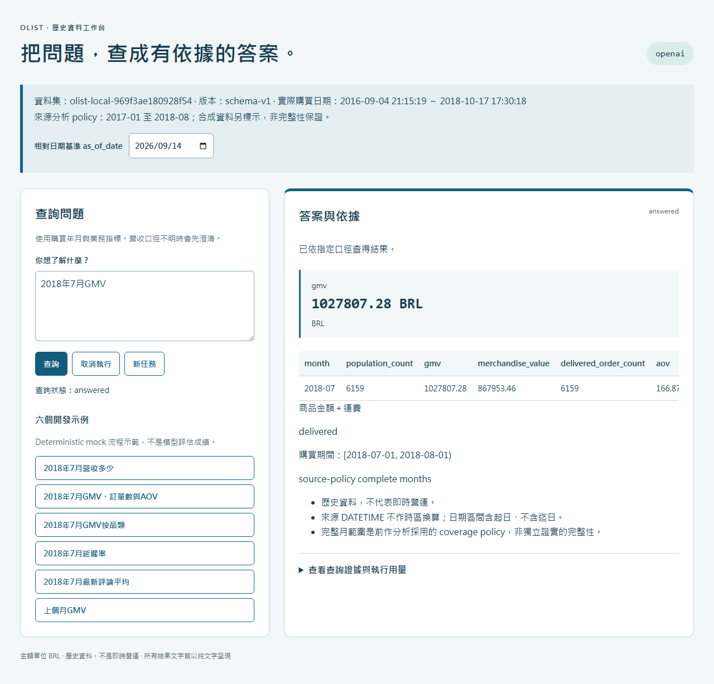

# Enterprise Query Agent

[](https://github.com/kuotunyu/enterprise-query-agent/actions/workflows/tests.yml)
[](LICENSE)

用中文問 Olist 電商歷史資料（例如「2018年7月營收多少」），系統先確認你指的是哪一種營收，再用一條通過層層檢查的唯讀 SQL 到 MySQL 查詢，回傳可逐項核對的數字、結果表與 SQL 證據。

> Ask a MySQL e-commerce database questions in Chinese. The model only emits a typed query plan; the program compiles the SQL, and every statement must pass an AST allow-list and a verified SELECT-only connection before it runs.



*真模型（`openai`）模式的實際操作畫面：2018 年 7 月 delivered GMV **1,027,807.28 BRL**、6,159 筆訂單，與獨立核對值一致。*

## SQL 安全防線

模型的輸出在碰到資料庫之前要過下面幾關，任何一關沒過就不執行：

- **SQL 語法樹白名單（SQLGlot AST allow-list）**：只接受單一 SELECT 或非遞迴 WITH；寫入、多語句、跨 schema、變數、鎖、hint 與可執行註解一律拒絕，資料表、欄位與函式都必須在白名單內。見 [`sql_policy.py`](src/enterprise_query/sql_policy.py)。
- **連線權限驗證（grants verification）**：每次查詢前確認 `DATABASE()`、`CURRENT_USER()` 與 MySQL 8.4，並解析 `SHOW GRANTS`；帳號只要有白名單資料表 SELECT 以外的權限（含萬用字元或 GRANT OPTION）就拒絕執行。見 [`executor.py`](src/enterprise_query/executor.py)。
- **連線層級取消（connection-level cancel）**：每條 SQL 5 秒期限；逾時或使用者取消時用 `KILL CONNECTION` 而不是 `KILL QUERY`，因為後者會留下一條閒置連線，取消後仍可能送出 SQL。結果上限 200 列，超過即標示截斷，不從截斷結果推算總數。
- **Decimal 精確數值與獨立核對（Decimal reconciliation）**：金額與比率全程用 `Decimal` 計算（[`facts.py`](src/enterprise_query/facts.py)）；上圖的 7 月 GMV 與另一條獨立計算路徑的核對值相同。

建庫帳號與查詢帳號分離，Web 只拿得到唯讀帳號；模型沒有 shell、管理工具或資料庫密碼。

## 40 題比較：三種做法

同一個模型（`gpt-5.6-luna`）、同一份資料、同一套執行防線，只跑一次、不重跑：

| 做法 | 嚴格契約成功／40 | 共通支援子集／31 | 中位延遲 |
|---|---:|---:|---:|
| A 固定 SQL 模板 | 30 | 30 | 3.64 秒 |
| B 模型直接寫 SQL | 23 | 18 | 5.66 秒 |
| C 型別化查詢計畫＋編譯器 | 31 | 24 | 4.26 秒 |

**怎麼讀**：計畫式（C）只比固定模板（A）多對一題，不能說它普遍較好；在三種做法都支援的題目上，固定模板反而最穩定。模型直接寫 SQL（B）在兩個分母上都最低。「嚴格契約」指狀態、澄清行為、指標／時間／維度與數值全部符合才算成功，不是單純的數字正確率。完整分題型結果、代表性失敗與費用見 [正式報告](reports/formal-luna.md)。

連結：[v1.0.0 release](https://github.com/kuotunyu/enterprise-query-agent/releases/tag/v1.0.0)。工作台在本機執行，沒有雲端部署或線上 demo。

## 快速開始

需要 uv 與已啟動的 Docker Desktop／Docker Engine。第一次下載 Python 3.12、依賴與 MySQL image 需要網路。

```powershell
uv sync --frozen --python 3.12
uv run python scripts/configure_local.py      # 產生本機隨機密碼與兩份 env
uv run python scripts/check_mysql_port.py     # 確認資料庫埠沒被占用
docker compose --env-file .local/bootstrap.env up -d --wait
uv run --env-file .local/bootstrap.env python scripts/bootstrap_data.py
uv run --env-file .local/runtime.env python scripts/serve.py
```

開啟 [http://127.0.0.1:8010](http://127.0.0.1:8010)。這會建立可重現的合成資料環境；連接埠衝突、設定檔與真實 CSV 匯入見 [操作細節](docs/operations.md)。

**這樣啟動的工作台預設跑的是 deterministic mock planner**（[`planner.py`](src/enterprise_query/planner.py) 的 `MockPlanner`：對已知的單月問題做規則比對，不是語言模型），不需要 API key，認不得的問題會要求澄清或回覆不支援。要接上真模型，需設定 `EQA_ENABLE_PAID_API=1`、`EQA_PROVIDER=openai`、`EQA_MODEL=gpt-5.6-luna`、`EQA_COST_STAGE` 與本機 `OPENAI_API_KEY`，並先建立已核准上限的費用帳本；步驟見 [操作細節](docs/operations.md#接上真模型)。真模型的接線在 `providers.py`（工作台）與 `comparison.py`／`comparison_runner.py`（三種做法的比較）；上面的 40 題比較用的是真模型，不是 mock。

## 使用

1. 先看頁首標示的 `mock`／`openai` 模式、資料版本、實際資料日期與基準日期。
2. 選六個示例之一或輸入中文問題，例如「2018年7月營收多少」。
3. 「營收」會先澄清：含運 GMV／不含運商品金額／全部狀態付款。同一任務保留已確認的口徑；按「新任務」重新確認。
4. 查看數字、分母／缺值、結果表與限制；展開證據可看到 SQL、參數、型別、結果列、版本、hash 與用量。

## 運作方式


- 8 個版本化指標與有限的維度／篩選。工作台的計畫式做法沒有 raw SQL 後門；比較工具中「直接寫 SQL」產生的語句仍經過相同的 AST 白名單與唯讀 executor。
- 每任務最多 2 輪澄清、3 次規劃呼叫、3 條業務 SELECT；每條 SQL 5 秒、實際處理 60 秒、結果 200 列。等待使用者澄清不計處理時間。
- 聚合先統一到正確粒度；日期為半開區間，來源 DATETIME 不換時區。截斷的結果拒絕用來推算完整分組變化。
- `request_id` 在服務存活期間去重，revision 阻擋舊答案覆寫新畫面。

## 適用範圍與限制

- 比較規模小：40 題、單一領域、單一模型、只跑一次；出題與開發並非完全獨立，不是人類盲測。另有 24 個相依變體單獨報告，不與 40 題加總。
- 嚴格契約分數偏嚴：B 有 7 題、C 有 4 題的數值、時間與澄清檢查都通過，只因多附維度或補充指標而不算成功；分數保留原樣，不事後換規則。
- 安全防線限制的是 SQL 能做什麼，不保證模型理解對了問題；例如 C 曾把 `delivered` 放進州別篩選而得到空結果。
- 公開的是結果摘要；完整原始紀錄與標準答案留在本機，僅靠摘要不能獨立重播整個研究。
- 資料是 Olist 歷史快照，不代表即時營運；品類與賣家的訂單可能重疊，分組訂單數不可加總。
- 任務與去重狀態只在記憶體，重啟即清除，不保證 provider 端 exactly-once。結果不適合直接用於無人監督的商業決策。
- 費用：開發與正式比較兩階段的 API 費用保守上界合計約 US$0.29（各自上限 US$25／US$20），精確帳單不可得。帳本機制見 [操作細節](docs/operations.md#費用帳本規格)。

## 驗證

```powershell
# 不需要資料庫或模型的離線測試
uv run pytest -m "not integration and not ui" -q

# 真 MySQL：數值、權限、逾時、取消、截斷與身分
$env:EQA_INTEGRATION = "1"
uv run --env-file .local/runtime.env pytest -m "not ui" -q

# 瀏覽器與 26 題中文 mock 流程：先在另一個終端啟動合成測試 Web
# uv run --env-file .local/runtime.env python scripts/serve.py --port 8011
uv run playwright install chromium
$env:EQA_WEB_URL = "http://127.0.0.1:8011"
uv run --env-file .local/runtime.env pytest -q
```

缺少 MySQL／Web 的測試會明示 skip，不算 pass。CI 分成離線與 MySQL 兩個 job；v1.0.0 發布時為離線 114 項、MySQL 143 項通過。開發過程中保留的失敗與修正見 [工程驗證紀錄](reports/engineering.md)。

## 資料來源與授權

程式碼採 [MIT 授權](LICENSE)。資料與 schema 來源為 [kuotunyu/mysql-ecommerce-analytics](https://github.com/kuotunyu/mysql-ecommerce-analytics)，commit `619ad706c35951bd6b811ac56765d6ad097ddbaa`；保留 [來源檔案雜湊](provenance/source-manifest.json)、[上游 MIT 授權](provenance/UPSTREAM_LICENSE) 與 [ETL 說明](provenance/README.md)。九張來源表之外包含衍生的 geolocation_zip 與兩個 views。原始 CSV、密碼與本機設定不提交。

## 延伸閱讀

- [正式報告：三種做法的一次比較](reports/formal-luna.md)
- [操作細節：設定檔、連接埠、真資料、真模型與費用帳本](docs/operations.md)
- [工程驗證紀錄](reports/engineering.md)
